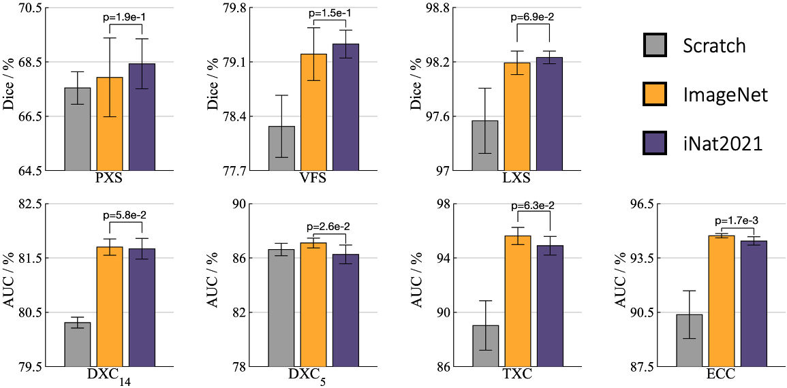
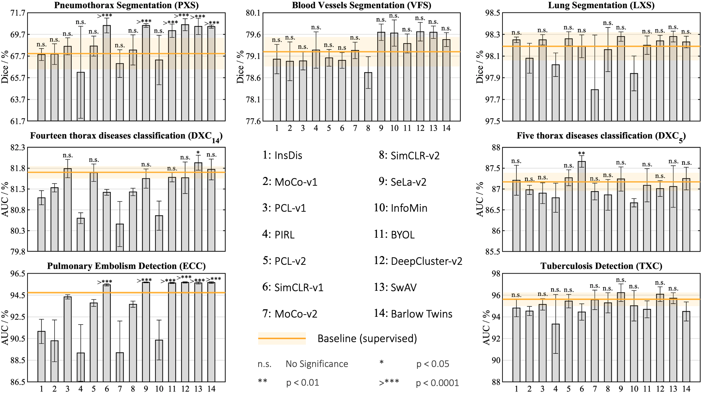
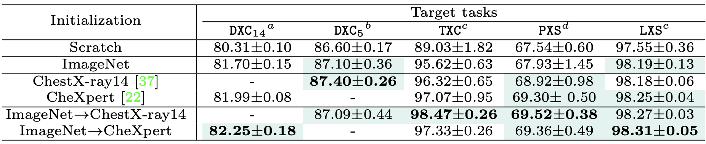

# A Systematic Benchmarking Analysis of Transfer Learning for Medical Image Analysis
We provide the first fine-grained and up-to-date study on the transferability of various brand-new pre-training techniques for medical imaging tasks. In particular, we conduct a systematic study on the transferability of (1) models pre-trained on [iNat2021](https://github.com/visipedia/newt), the most recent large-scale fine-grained dataset, (2) 14 top self-supervised ImageNet models, and (3) domain-adapted models that are continuously pre-trained on natural and medical datasets.

In this repository we release multiple models from our paper as well as the code to fine-tuning the released models in desired target tasks. 
We hope that in the light of our study, the medical imaging community will benefit from the use of more powerful pre-trained models than conventional supervised models pre-trained on the ImageNet dataset.

## Publication
<b>A Systematic Benchmarking Analysis of Transfer Learning for Medical Image Analysis </b> <br/>

[Mohammad Reza Hosseinzadeh Taher](https://github.com/MR-HosseinzadehTaher)<sup>1</sup>, [Fatemeh Haghighi](https://github.com/fhaghighi)<sup>1</sup>, [Ruibin Feng](https://profiles.stanford.edu/ruibin-feng?releaseVersion=9.3.2)<sup>2</sup>, [Michael B. Gotway](https://www.mayoclinic.org/biographies/gotway-michael-b-m-d/bio-20055566)<sup>3</sup>, [Jianming Liang](https://chs.asu.edu/jianming-liang)<sup>1</sup><br/>
<sup>1 </sup>Arizona State University, <sup>2 </sup>Stanford University, <sup>3 </sup>Mayo Clinic <br/>
International Conference on Medical Image Computing and Computer Assisted Intervention ([MICCAI 2021](https://www.miccai2021.org/en/)); Domain Adaptation and Representation Transfer (DART) <br/>
[Paper](https://arxiv.org/pdf/2108.05930.pdf) | [Poster]() | [Code]() | Presentation ([YouTube](https://youtu.be/uiaspidurdg), [YouKu](https://v.youku.com/v_show/id_XNTgxMTI5NTkyOA==.html))

## Major results from our work
1. **Pre-trained models on fine-grained data are better suited for segmentation tasks, while pre-trained models on coarse-grained data prevail  on  classification  tasks.**
<br/>
<p align="center"></p>
<br/>

2. **Self-supervised ImageNet models outperform supervised ImageNet models in medical imaging tasks.**
<br/>
<p align="center"></p>
<br/>

3. **Domain-adaptive pre-training bridges the gap between the natural  and  medical  imaging  domains.**
<br/>
<p align="center"></p>
<br/>

## Installation
Clone the repository and install dependencies using the following command:
```bash
$ git clone https://github.com/MR-HosseinzadehTaher/BenchmarkTransferLearning.git
$ cd BenchmarkTransferLearning/
$ pip install -r requirements.txt
```

## Model Zoo
In this paper, we evaluate 21 pre-trained ResNet50 models, including: 1 supervised ImageNet model, 14 self-supervised ImageNet models, 2 supervised iNat models, 2 in-domain pre-trained models, and 2 domain-adapted pre-trained models. We prepare self-supervised ImageNet models by referring to the released code by [Linus Ericsson et al](https://github.com/linusericsson/ssl-transfer). To download and prepare all models in the same format, run:

```bash
python download_and_prepare_models.py
```

**Note 1**: iNat2021 models must be downloaded manually (using the links in the table below).

**Note 2**: For SimCLR-v1 and SimCLR-v2, the TensorFlow checkpoints need to be downloaded manually (using the links in the table below) and converted into PyTorch format (using https://github.com/tonylins/simclr-converter and https://github.com/Separius/SimCLRv2-Pytorch, respectively).

**Note 3**: For converting BYOL, you need to install some extra packages by running:
```
pip install jax jaxlib dill git+https://github.com/deepmind/dm-haiku
```


You can download the pretrained models used/developed in our paper as follows:

<table><tbody>
<!-- START TABLE -->
<!-- TABLE HEADER -->
 <th valign="bottom">Category</th>
<th valign="bottom">Backbone</th>
<th valign="bottom">Platform</th>
<th valign="bottom">Training Dataset</th>
<th valign="bottom">Training Objective</th>
<th valign="bottom">model</th>

<!-- TABLE BODY -->
 <tr >
  <td rowspan = "2" align="center">In-domain models</td>
<td align="center">ResNet50</td>
<td align="center">Pytorch</td>
<td align="center">ChestX-ray14</td>
<td align="center">Supervised</td>   
<td align="center"><a href="https://zenodo.org/record/5205234/files/chestxray14.pth.tar?download=1">download</a></td>

</tr>
 <tr> 
 <td align="center">ResNet50</td>
<td align="center">Pytorch</td>
<td align="center">ChexPert</td>
<td align="center">Supervised</td>   
<td align="center"><a href="https://zenodo.org/record/5205234/files/chexpert.pth.tar?download=1">download</a></td>
 </tr>
 
 <tr >
  <td rowspan = "2" align="center">Domain-adapted models</td>
<td align="center">ResNet50</td>
<td align="center">Pytorch</td>
<td align="center">ImageNet &#8594; ChestX-ray14</td>
<td align="center">Supervised &#8594; Supervised</td>   
<td align="center"><a href="https://zenodo.org/record/5205234/files/ImageNet_chestxray14.pth.tar?download=1">download</a></td>

</tr>
 <tr> 
 <td align="center">ResNet50</td>
<td align="center">Pytorch</td>
<td align="center">ImageNet &#8594; ChexPert</td>
<td align="center">Supervised &#8594; Supervised</td>   
<td align="center"><a href="https://zenodo.org/record/5205234/files/ImageNet_chexpert.pth.tar?download=1">download</a></td>
 </tr>
 
 <tr >
  <td rowspan = "2" align="center">iNat2021 models</td>
<td align="center">ResNet50</td>
<td align="center">Pytorch</td>
  <td align="center"><a href="https://github.com/visipedia/newt">iNat2021</a></td>
<td align="center">Supervised</td>   
<td  rowspan = "2" align="center"><a href="https://cornell.box.com/s/bnyhq5lwobu6fgjrub44zle0pyjijbmw">download</a></td>

</tr>
 <tr> 
 <td align="center">ResNet50</td>
<td align="center">Pytorch</td>
<td align="center"><a href="https://github.com/visipedia/newt">iNat2021 mini</a></td>
<td align="center">Supervised</td>   

 </tr>
 
 <tr >
  <td rowspan = "14" align="center">Self-supervised models</td>
<td align="center">ResNet50</td>
<td align="center">Pytorch</td>
<td align="center">ImageNet</td>
<td align="center"><a href="https://arxiv.org/abs/2103.03230">Barlow Twins</a></td>   
<td align="center"><a href="https://dl.fbaipublicfiles.com/barlowtwins/ep1000_bs2048_lrw0.2_lrb0.0048_lambd0.0051/resnet50.pth">download</a></td>

</tr>
 <tr> 
 <td align="center">ResNet50</td>
<td align="center">Pytorch</td>
<td align="center">ImageNet</td>
<td align="center"><a href="https://arxiv.org/abs/2006.09882">SwAV</a></td>  
<td align="center"><a href="https://dl.fbaipublicfiles.com/deepcluster/swav_800ep_pretrain.pth.tar">download</a></td>
 </tr>
 
 <tr> 
<td align="center">ResNet50</td>
<td align="center">Pytorch</td>
<td align="center">ImageNet</td>
<td align="center"><a href="https://arxiv.org/abs/2006.09882">DeepCluster-v2</a></td>   
<td align="center"><a href="https://dl.fbaipublicfiles.com/deepcluster/deepclusterv2_800ep_pretrain.pth.tar">download</a></td>
 </tr>
 
  <tr> 
<td align="center">ResNet50</td>
<td align="center">Pytorch</td>
<td align="center">ImageNet</td>
<td align="center"><a href="https://arxiv.org/abs/2006.09882">Sela-v2</a></td>   
<td align="center"><a href="https://dl.fbaipublicfiles.com/deepcluster/selav2_400ep_pretrain.pth.tar">download</a></td>
 </tr>
 
 <tr> 
<td align="center">ResNet50</td>
<td align="center">Pytorch</td>
<td align="center">ImageNet</td>
<td align="center"><a href="https://arxiv.org/abs/1805.01978">InsDis</a></td>   
<td align="center"><a href="https://www.dropbox.com/sh/87d24jqsl6ra7t2/AACcsSIt1_Njv7GsmsuzZ6Sta/InsDis.pth">download</a></td>
 </tr>
 
  <tr> 
<td align="center">ResNet50</td>
<td align="center">Pytorch</td>
<td align="center">ImageNet</td>
<td align="center"><a href="https://arxiv.org/abs/1911.05722">MoCo-v1</a></td>   
<td align="center"><a href="https://dl.fbaipublicfiles.com/moco/moco_checkpoints/moco_v1_200ep/moco_v1_200ep_pretrain.pth.tar">download</a></td>
 </tr>
 
 <tr> 
<td align="center">ResNet50</td>
<td align="center">Pytorch</td>
<td align="center">ImageNet</td>
<td align="center"><a href="https://arxiv.org/abs/2003.04297">MoCo-v2</a></td>   
<td align="center"><a href="https://dl.fbaipublicfiles.com/moco/moco_checkpoints/moco_v2_800ep/moco_v2_800ep_pretrain.pth.tar">download</a></td>
 </tr>
 
 <tr> 
<td align="center">ResNet50</td>
<td align="center">Pytorch</td>
<td align="center">ImageNet</td>
<td align="center"><a href="https://arxiv.org/abs/2005.04966">PCL-v1</a></td>   
<td align="center"><a href="https://storage.googleapis.com/sfr-pcl-data-research/PCL_checkpoint/PCL_v1_epoch200.pth.tar">download</a></td>
 </tr>
 
  <tr> 
<td align="center">ResNet50</td>
<td align="center">Pytorch</td>
<td align="center">ImageNet</td>
<td align="center"><a href="https://arxiv.org/abs/2005.04966">PCL-v2</a></td>   
<td align="center"><a href="https://storage.googleapis.com/sfr-pcl-data-research/PCL_checkpoint/PCL_v2_epoch200.pth.tar">download</a></td>
 </tr>
 
 <tr> 
<td align="center">ResNet50</td>
<td align="center">Pytorch</td>
<td align="center">ImageNet</td>
<td align="center"><a href="https://arxiv.org/abs/2002.05709">SimCLR-v1</a></td>   
<td align="center"><a href="https://storage.cloud.google.com/simclr-gcs/checkpoints/ResNet50_1x.zip">download</a></td>
 </tr>
 
 <tr> 
<td align="center">ResNet50</td>
<td align="center">Pytorch</td>
<td align="center">ImageNet</td>
<td align="center"><a href="https://arxiv.org/abs/2006.10029">SimCLR-v2</a></td>   
<td align="center"><a href="https://console.cloud.google.com/storage/browser/simclr-checkpoints/simclrv2/pretrained/r50_1x_sk0">download</a></td>
 </tr>
 
 <tr> 
<td align="center">ResNet50</td>
<td align="center">Pytorch</td>
<td align="center">ImageNet</td>
<td align="center"><a href="https://arxiv.org/abs/2005.10243">InfoMin</a></td>   
<td align="center"><a href="https://www.dropbox.com/sh/87d24jqsl6ra7t2/AAAzMTynP3Qc8mIE4XWkgILUa/InfoMin_800.pth">download</a></td>
 </tr>
 
<tr> 
<td align="center">ResNet50</td>
<td align="center">Pytorch</td>
<td align="center">ImageNet</td>
<td align="center"><a href="https://arxiv.org/abs/1912.01991">PIRL</a></td>   
<td align="center"><a href="https://github.com/HobbitLong/PyContrast/blob/master/pycontrast/docs/MODEL_ZOO.md">download</a></td>
 </tr>
 
 <tr> 
<td align="center">ResNet50</td>
<td align="center">Pytorch</td>
<td align="center">ImageNet</td>
<td align="center"><a href="https://arxiv.org/abs/2006.07733">BYOL</a></td>   
<td align="center"><a href="https://storage.googleapis.com/deepmind-byol/checkpoints/pretrain_res50x1.pkl">download</a></td>
 </tr>
 
 
</tbody></table>

For the iNat21 and self-supervised ImageNet models, we used the official publicly available pre-trained models from the original papers, so, we give credit to the corresponding authors. 

## Datasets
Datasets can be downloaded from the following links.

[ChestX-ray14](https://nihcc.app.box.com/v/ChestXray-NIHCC)

[ChexPert](https://stanfordmlgroup.github.io/competitions/chexpert/)

[DRIVE](https://drive.grand-challenge.org/) (pre-processed dataset can be downloaded from [here](https://github.com/clguo/SA-UNet/tree/844808189526afaf06296ba6c135b9c0ba67d70a))

[Montgomery](https://lhncbc.nlm.nih.gov/LHC-publications/pubs/TuberculosisChestXrayImageDataSets.html) 

[Shenzhen](https://lhncbc.nlm.nih.gov/LHC-publications/pubs/TuberculosisChestXrayImageDataSets.html)

[RSNA PE detection](https://www.kaggle.com/c/rsna-str-pulmonary-embolism-detection/data)

[SIIM-ACR Pneumothorax Segmentation](https://www.kaggle.com/c/siim-acr-pneumothorax-segmentation/data)

For the classificatin tasks, we have provided data splits in the dataset directory. For each of train, test, and validation sets, a text file including images and labels information is provided. For the segmentation tasks, you need to put the train, test, and validation sets into separate folders.  

## Fine-tuing of pre-trained models on target task
1. Download the desired pre-trained model from the above-mentioned links.
2. Download the desired dataset; you can simply add any other dataset that you wish.
3. For classification tasks, run the following command by the desired parameters. For example, to finetune barlowtwins on ChestX-ray14, run:
```bash
python main_classification.py --data_set ChestXray14  \
--init barlowtwins \
--proxy_dir path/to/pre-trained-model \
--data_dir path/to/dataset \
--train_list dataset/Xray14_train_official.txt \
--val_list dataset/Xray14_val_official.txt \
--test_list dataset/Xray14_test_official.txt 
```
Or, to evaluate supervised ImageNet model on ChestX-ray14, run:
```bash
python main_classification.py --data_set ChestXray14  \
--init ImageNet \
--data_dir path/to/dataset \
--train_list dataset/Xray14_train_official.txt \
--val_list dataset/Xray14_val_official.txt \
--test_list dataset/Xray14_test_official.txt 
```

4. For segmentation tasks, run the following command by the desired parameters. For example, to finetune barlowtwins on DRIVE, run:
```bash
python main_segmentation.py --data_set DRIVE  \
--init barlowtwins \
--proxy_dir path/to/pre-trained-model \
--train_data_dir path/to/train/images \
--train_mask_dir path/to/train/masks \
--valid_data_dir path/to/validation/images \
--valid_mask_dir path/to/validation/masks \
--test_data_dir path/to/test/images \
--test_mask_dir path/to/test/masks
```
Or, to evaluate supervised ImageNet model on DRIVE, run:

```bash
python main_segmentation.py --data_set DRIVE  \
--init ImageNet \
--train_data_dir path/to/train/images \
--train_mask_dir path/to/train/masks \
--valid_data_dir path/to/validation/images \
--valid_mask_dir path/to/validation/masks \
--test_data_dir path/to/test/images \
--test_mask_dir path/to/test/masks
```

## Citation
If you use this code or use our pre-trained weights for your research, please cite our paper:
```
@misc{taher2021systematic,
      title={A Systematic Benchmarking Analysis of Transfer Learning for Medical Image Analysis}, 
      author={Mohammad Reza Hosseinzadeh Taher and Fatemeh Haghighi and Ruibin Feng and Michael B. Gotway and Jianming Liang},
      year={2021},
      eprint={2108.05930},
      archivePrefix={arXiv},
      primaryClass={cs.CV}
}
```


## Acknowledgement
This research has been supported partially by ASU and Mayo Clinic through a Seed Grant and an Innovation Grant, and partially by the NIH under Award Number R01HL128785.  The content is solely the responsibility of the authors and does not necessarily represent the official views of the NIH. This work has utilized the GPUs provided partially by the ASU Research Computing and partially by the Extreme Science and Engineering Discovery Environment (XSEDE) funded by the National Science Foundation (NSF) under grant number ACI-1548562. We thank Nahid Islam for evaluating the self-supervised methods on the PE detection target task.  The content of this paper is covered by patents pending. We build U-Net architecture for segmentation tasks by referring to the released code at [segmentation_models.pytorch](https://github.com/qubvel/segmentation_models.pytorch).


## License

Released under the [ASU GitHub Project License](./LICENSE).


