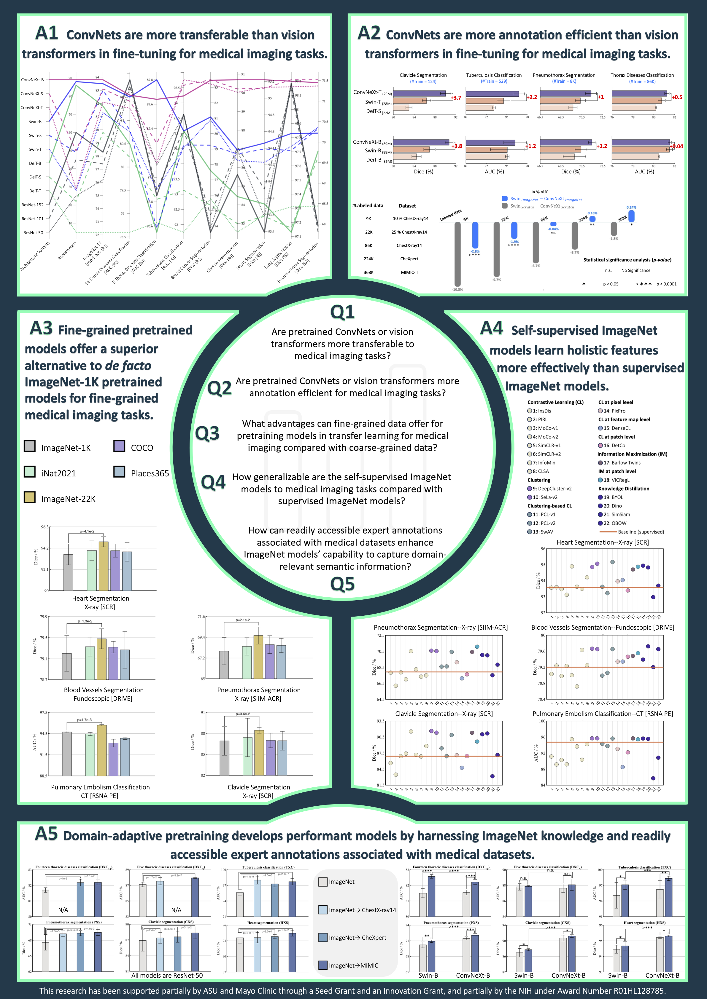

# Large-scale Benchmarking and Boosting Transfer Learning for Medical Image Analysis
A comprehensive systematic study of transfer learning of numerous models with distinct architectures pretrained on various datasets using different strategies for medical imaging applications, focusing on (i) benchmarking numerous conventional and modern convolutional neural network (ConvNet) and vision transformer architectures across various medical tasks; (ii) investigating the impact of fine-tuning data size on the performance of ConvNets compared with vision transformers in medical imaging; (iii) examining the impact of pretraining data granularity on transfer learning performance; (iv) evaluating transferability of a wide range of recent self-supervised methods with diverse training objectives to a variety of medical tasks across different modalities; and (v) delving into the efficacy of domain-adaptive pretraining on both photographic and medical datasets to develop high-performance models for medical tasks.

<p align="center"></p>

## Publication
<b>Large-scale benchmarking and boosting transfer learning for medical image analysis </b> <br/>

[Mohammad Reza Hosseinzadeh Taher](https://github.com/MR-HosseinzadehTaher)<sup>1</sup>, [Fatemeh Haghighi](https://github.com/fhaghighi)<sup>1</sup>, [Michael B. Gotway](https://www.mayoclinic.org/biographies/gotway-michael-b-m-d/bio-20055566)<sup>2</sup>, [Jianming Liang](https://chs.asu.edu/jianming-liang)<sup>1</sup><br/>
<sup>1 </sup>Arizona State University, <sup>2 </sup>Mayo Clinic <br/>
Medical Image Analysis (MedIA), 2025 <br/>

[Paper](https://www.sciencedirect.com/science/article/abs/pii/S1361841525000350) | [Code](https://github.com/MR-HosseinzadehTaher/BenchmarkTransferLearning) 

## Installation
Clone the repository and install dependencies using the following command:
```bash
$ git clone https://github.com/MR-HosseinzadehTaher/BenchmarkTransferLearning.git
$ cd BenchmarkTransferLearning
$ pip install -r requirements.txt
```

## Model Zoo
You can download the pretrained models used/developed in our paper as follows:

<table><tbody>
<!-- START TABLE -->
<!-- TABLE HEADER -->
 <th valign="bottom">Category</th>
<th valign="bottom">Backbone</th>
<th valign="bottom">Platform</th>
<th valign="bottom">Training Dataset</th>
<th valign="bottom">Training Objective</th>
<th valign="bottom">model</th>

<!-- TABLE BODY -->

 <tr >
  <td rowspan = "5" align="center">Domain-adapted models</td>
<td align="center">ResNet50</td>
<td align="center">Pytorch</td>
<td align="center">ImageNet &#8594; ChestX-ray14</td>
<td align="center">Supervised &#8594; Supervised</td>   
<td align="center"><a href="https://zenodo.org/record/5205234/files/ImageNet_chestxray14.pth.tar?download=1">download</a></td>

</tr>
 <tr> 
 <td align="center">ResNet50</td>
<td align="center">Pytorch</td>
<td align="center">ImageNet &#8594; ChexPert</td>
<td align="center">Supervised &#8594; Supervised</td>   
<td align="center"><a href="https://zenodo.org/record/5205234/files/ImageNet_chexpert.pth.tar?download=1">download</a></td>
 </tr>

<tr> 
 <td align="center">ResNet50</td>
<td align="center">Pytorch</td>
<td align="center">ImageNet &#8594; MIMIC</td>
<td align="center">Supervised &#8594; Supervised</td>   
<td align="center"><a href="">download</a></td>
 </tr>

<tr> 
 <td align="center">Swin-B</td>
<td align="center">Pytorch</td>
<td align="center">ImageNet &#8594; MIMIC</td>
<td align="center">Supervised &#8594; Supervised</td>   
<td align="center"><a href="">download</a></td>
 </tr>

<tr> 
 <td align="center">ConvNeXt-B</td>
<td align="center">Pytorch</td>
<td align="center">ImageNet &#8594; MIMIC</td>
<td align="center">Supervised &#8594; Supervised</td>   
<td align="center"><a href="">download</a></td>
 </tr>

<tr >
  <td rowspan = "6" align="center">ImageNet-1K models</td>
<td align="center">Swin-T</td>
<td align="center">Pytorch</td>
  <td align="center">ImageNet-1K</td>
<td align="center">Supervised</td>   
  <td align="center"><a href="https://github.com/SwinTransformer/storage/releases/download/v1.0.0/swin_tiny_patch4_window7_224.pth">download</a></td>

</tr>
<tr >
<td align="center">Swin-S</td>
<td align="center">Pytorch</td>
  <td align="center">ImageNet-1K</td>
<td align="center">Supervised</td>   
  <td align="center"><a href="https://github.com/SwinTransformer/storage/releases/download/v1.0.0/swin_small_patch4_window7_224.pth">download</a></td>
</tr>
<tr >
<td align="center">Swin-B</td>
<td align="center">Pytorch</td>
  <td align="center">ImageNet-1K</td>
<td align="center">Supervised</td>   
  <td align="center"><a href="https://github.com/SwinTransformer/storage/releases/download/v1.0.0/swin_base_patch4_window7_224.pth">download</a></td>
</tr>
 <tr> 
 <td align="center">ConvNeXt-T</td>
<td align="center">Pytorch</td>
<td align="center">ImageNet-1K</td>
<td align="center">Supervised</td> 
<td align="center"><a href="https://dl.fbaipublicfiles.com/convnext/convnext_tiny_1k_224_ema.pth">download</a></td>

 </tr>
<tr> 
 <td align="center">ConvNeXt-S</td>
<td align="center">Pytorch</td>
<td align="center">ImageNet-1K</td>
<td align="center">Supervised</td>   
<td align="center"><a href="https://dl.fbaipublicfiles.com/convnext/convnext_small_1k_224_ema.pth">download</a></td>


 </tr>
<tr> 
 <td align="center">ConvNeXt-B</td>
<td align="center">Pytorch</td>
<td align="center">ImageNet-1K</td>
<td align="center">Supervised</td>   
<td align="center"><a href="https://dl.fbaipublicfiles.com/convnext/convnext_base_1k_224_ema.pth">download</a></td>
 </tr>
 <tr >
  <td rowspan = "2" align="center">iNat2021 models</td>
<td align="center">ResNet50</td>
<td align="center">Pytorch</td>
  <td align="center"><a href="https://github.com/visipedia/newt">iNat2021</a></td>
<td align="center">Supervised</td>   
<td  rowspan = "2" align="center"><a href="https://cornell.box.com/s/bnyhq5lwobu6fgjrub44zle0pyjijbmw">download</a></td>

</tr>
 <tr> 
 <td align="center">ResNet50</td>
<td align="center">Pytorch</td>
<td align="center"><a href="https://github.com/visipedia/newt">iNat2021 mini</a></td>
<td align="center">Supervised</td>   

 </tr>
 
 <tr >
  <td rowspan = "14" align="center">Self-supervised models</td>
<td align="center">ResNet50</td>
<td align="center">Pytorch</td>
<td align="center">ImageNet</td>
<td align="center"><a href="https://arxiv.org/abs/2103.03230">Barlow Twins</a></td>   
<td align="center"><a href="https://dl.fbaipublicfiles.com/barlowtwins/ep1000_bs2048_lrw0.2_lrb0.0048_lambd0.0051/resnet50.pth">download</a></td>

</tr>
 <tr> 
 <td align="center">ResNet50</td>
<td align="center">Pytorch</td>
<td align="center">ImageNet</td>
<td align="center"><a href="https://arxiv.org/abs/2006.09882">SwAV</a></td>  
<td align="center"><a href="https://dl.fbaipublicfiles.com/deepcluster/swav_800ep_pretrain.pth.tar">download</a></td>
 </tr>
 
 <tr> 
<td align="center">ResNet50</td>
<td align="center">Pytorch</td>
<td align="center">ImageNet</td>
<td align="center"><a href="https://arxiv.org/abs/2006.09882">DeepCluster-v2</a></td>   
<td align="center"><a href="https://dl.fbaipublicfiles.com/deepcluster/deepclusterv2_800ep_pretrain.pth.tar">download</a></td>
 </tr>
 
  <tr> 
<td align="center">ResNet50</td>
<td align="center">Pytorch</td>
<td align="center">ImageNet</td>
<td align="center"><a href="https://arxiv.org/abs/2006.09882">Sela-v2</a></td>   
<td align="center"><a href="https://dl.fbaipublicfiles.com/deepcluster/selav2_400ep_pretrain.pth.tar">download</a></td>
 </tr>
 
 <tr> 
<td align="center">ResNet50</td>
<td align="center">Pytorch</td>
<td align="center">ImageNet</td>
<td align="center"><a href="https://arxiv.org/abs/1805.01978">InsDis</a></td>   
<td align="center"><a href="https://www.dropbox.com/sh/87d24jqsl6ra7t2/AACcsSIt1_Njv7GsmsuzZ6Sta/InsDis.pth">download</a></td>
 </tr>
 
  <tr> 
<td align="center">ResNet50</td>
<td align="center">Pytorch</td>
<td align="center">ImageNet</td>
<td align="center"><a href="https://arxiv.org/abs/1911.05722">MoCo-v1</a></td>   
<td align="center"><a href="https://dl.fbaipublicfiles.com/moco/moco_checkpoints/moco_v1_200ep/moco_v1_200ep_pretrain.pth.tar">download</a></td>
 </tr>
 
 <tr> 
<td align="center">ResNet50</td>
<td align="center">Pytorch</td>
<td align="center">ImageNet</td>
<td align="center"><a href="https://arxiv.org/abs/2003.04297">MoCo-v2</a></td>   
<td align="center"><a href="https://dl.fbaipublicfiles.com/moco/moco_checkpoints/moco_v2_800ep/moco_v2_800ep_pretrain.pth.tar">download</a></td>
 </tr>
 
 <tr> 
<td align="center">ResNet50</td>
<td align="center">Pytorch</td>
<td align="center">ImageNet</td>
<td align="center"><a href="https://arxiv.org/abs/2005.04966">PCL-v1</a></td>   
<td align="center"><a href="https://storage.googleapis.com/sfr-pcl-data-research/PCL_checkpoint/PCL_v1_epoch200.pth.tar">download</a></td>
 </tr>
 
  <tr> 
<td align="center">ResNet50</td>
<td align="center">Pytorch</td>
<td align="center">ImageNet</td>
<td align="center"><a href="https://arxiv.org/abs/2005.04966">PCL-v2</a></td>   
<td align="center"><a href="https://storage.googleapis.com/sfr-pcl-data-research/PCL_checkpoint/PCL_v2_epoch200.pth.tar">download</a></td>
 </tr>
 
 <tr> 
<td align="center">ResNet50</td>
<td align="center">Pytorch</td>
<td align="center">ImageNet</td>
<td align="center"><a href="https://arxiv.org/abs/2002.05709">SimCLR-v1</a></td>   
<td align="center"><a href="https://storage.cloud.google.com/simclr-gcs/checkpoints/ResNet50_1x.zip">download</a></td>
 </tr>
 
 <tr> 
<td align="center">ResNet50</td>
<td align="center">Pytorch</td>
<td align="center">ImageNet</td>
<td align="center"><a href="https://arxiv.org/abs/2006.10029">SimCLR-v2</a></td>   
<td align="center"><a href="https://console.cloud.google.com/storage/browser/simclr-checkpoints/simclrv2/pretrained/r50_1x_sk0">download</a></td>
 </tr>
 
 <tr> 
<td align="center">ResNet50</td>
<td align="center">Pytorch</td>
<td align="center">ImageNet</td>
<td align="center"><a href="https://arxiv.org/abs/2005.10243">InfoMin</a></td>   
<td align="center"><a href="https://www.dropbox.com/sh/87d24jqsl6ra7t2/AAAzMTynP3Qc8mIE4XWkgILUa/InfoMin_800.pth">download</a></td>
 </tr>
 
<tr> 
<td align="center">ResNet50</td>
<td align="center">Pytorch</td>
<td align="center">ImageNet</td>
<td align="center"><a href="https://arxiv.org/abs/1912.01991">PIRL</a></td>   
<td align="center"><a href="https://github.com/HobbitLong/PyContrast/blob/master/pycontrast/docs/MODEL_ZOO.md">download</a></td>
 </tr>
 
 <tr> 
<td align="center">ResNet50</td>
<td align="center">Pytorch</td>
<td align="center">ImageNet</td>
<td align="center"><a href="https://arxiv.org/abs/2006.07733">BYOL</a></td>   
<td align="center"><a href="https://storage.googleapis.com/deepmind-byol/checkpoints/pretrain_res50x1.pkl">download</a></td>
 </tr>
 
 
</tbody></table>

For all pretrained models, except those we domain-adapted, we employed the official publicly released weights from the respective original papers, and we acknowledge the corresponding authors.

## Datasets
Datasets can be downloaded from the following links.

[ChestX-ray14](https://nihcc.app.box.com/v/ChestXray-NIHCC)

[ChexPert](https://stanfordmlgroup.github.io/competitions/chexpert/)

[DRIVE](https://drive.grand-challenge.org/) (pre-processed dataset can be downloaded from [here](https://github.com/clguo/SA-UNet/tree/844808189526afaf06296ba6c135b9c0ba67d70a))

[Montgomery](https://lhncbc.nlm.nih.gov/LHC-publications/pubs/TuberculosisChestXrayImageDataSets.html) 

[Shenzhen](https://lhncbc.nlm.nih.gov/LHC-publications/pubs/TuberculosisChestXrayImageDataSets.html)

[RSNA PE detection](https://www.kaggle.com/c/rsna-str-pulmonary-embolism-detection/data)

[SIIM-ACR Pneumothorax Segmentation](https://www.kaggle.com/c/siim-acr-pneumothorax-segmentation/data)

For the classificatin tasks, we have provided data splits in the dataset directory. For each of train, test, and validation sets, a text file including images and labels information is provided. For the segmentation tasks, you need to put the train, test, and validation sets into separate folders.  

## Fine-tuning of pre-trained models on target tasks
1. Download the desired pre-trained model from the above-mentioned links.
2. Download the desired dataset; you can simply add any other dataset that you wish.
3. For classification tasks, run the following command by the desired parameters. For example, to finetune ImageNet-1K model with ConvNeXt-base backbone on ChestX-ray14, run:
```bash
python main_classification.py --data_set ChestXray14  \
--init imagenet_1k \
--model convnext_base \
--proxy_dir path/to/pre-trained-model \
--data_dir path/to/dataset \
--train_list dataset/Xray14_train_official.txt \
--val_list dataset/Xray14_val_official.txt \
--test_list dataset/Xray14_test_official.txt \
--num_class 14
```
Or, to evaluate ImageNet-1K model with Swin-base backbone on ChestX-ray14, run:
```bash
python main_classification.py --data_set ChestXray14  \
--init imagenet_1k \
--data_dir path/to/dataset \
--model swin_base \
--train_list dataset/Xray14_train_official.txt \
--val_list dataset/Xray14_val_official.txt \
--test_list dataset/Xray14_test_official.txt \
--num_class 14
```

4. For segmentation tasks, run the following command by the desired parameters. For example, to finetune ImageNet-1K model with ConvNeXt-base backbone on clavicle segmentation, run:
```bash
python main_segmentation.py --data_set SCR-Clavicle  \
--arch convnext_upernet  \
--backbone convnext_base \
--init imagenet_1k \
--proxy_dir path/to/pre-trained-model \
--train_data_dir path/to/train/images \
--train_mask_dir path/to/train/masks \
--valid_data_dir path/to/validation/images \
--valid_mask_dir path/to/validation/masks \
--test_data_dir path/to/test/images \
--test_mask_dir path/to/test/masks \
--train_file_path path/to/train/file/split \
--valid_file_path path/to/val/file/split \
--test_file_path path/to/test/file/split
```
Or, to evaluate ImageNet-1K model with Swin-base backbone on clavicle segmentation, run:

```bash
python main_segmentation.py --data_set SCR-Clavicle  \
--arch swin_upernet  \
--backbone swin_base \
--init imagenet_1k \
--train_data_dir path/to/train/images \
--train_mask_dir path/to/train/masks \
--valid_data_dir path/to/validation/images \
--valid_mask_dir path/to/validation/masks \
--test_data_dir path/to/test/images \
--test_mask_dir path/to/test/masks \
--train_file_path path/to/train/file/split \
--valid_file_path path/to/val/file/split \
--test_file_path path/to/test/file/split
```

## Citation
If you use this code or use our pre-trained weights for your research, please cite our paper:
```
@article{taher2025large,
  title={Large-scale benchmarking and boosting transfer learning for medical image analysis},
  author={Taher, Mohammad Reza Hosseinzadeh and Haghighi, Fatemeh and Gotway, Michael B and Liang, Jianming},
  journal={Medical image analysis},
  volume={102},
  pages={103487},
  year={2025},
  publisher={Elsevier}
}
```


## Acknowledgement
This research has been supported in part by ASU and Mayo Clinic through a Seed Grant and an Innovation Grant, and in part by the NIH under Award Number R01HL128785. The content is solely the responsibility of the authors and does not necessarily represent the official views of the NIH. This work has utilized the GPUs provided in part by the ASU Research Computing and in part by the Bridges-2 at Pittsburgh Supercomputing Center through allocation BCS190015 and the Anvil at Purdue University through allocation MED220025 from the Advanced Cyberinfrastructure Coordination Ecosystem: Services & Support (ACCESS) program, which is supported by National Science Foundation grants #2138259, #2138286, #2138307, #2137603, and #2138296. The content of this paper is covered by patents pending. We thank Nahid Ul Islam and Ruibin Feng for evaluating 14 self-supervised ImageNet models, including InsDis, MoCo-v1, MoCo-v2, SimCLR-v1, SimCLR-v2, BYOL, PIRL, DeepCluster-v2, SeLa-v2, PCL-v1, PCL-v2, SwAV, InfoMin, and Barlow Twins, on target tasks: ECC (by Nahid), and DXC$_{14}$ and DXC$_{5}$ (by Ruibin), respectively.   The content of this paper is covered by patents pending. This work utilizes implementations of ConvNeXt and Swin Transformer, adapted from their official GitHub repositories: [ConvNeXt](https://github.com/facebookresearch/ConvNeXt)
 and [Swin Transformer](https://github.com/microsoft/Swin-Transformer). We also build U-Net architecture for segmentation tasks by referring to the released code at [segmentation_models.pytorch](https://github.com/qubvel/segmentation_models.pytorch).


## License

Released under the [ASU GitHub Project License](./LICENSE).


